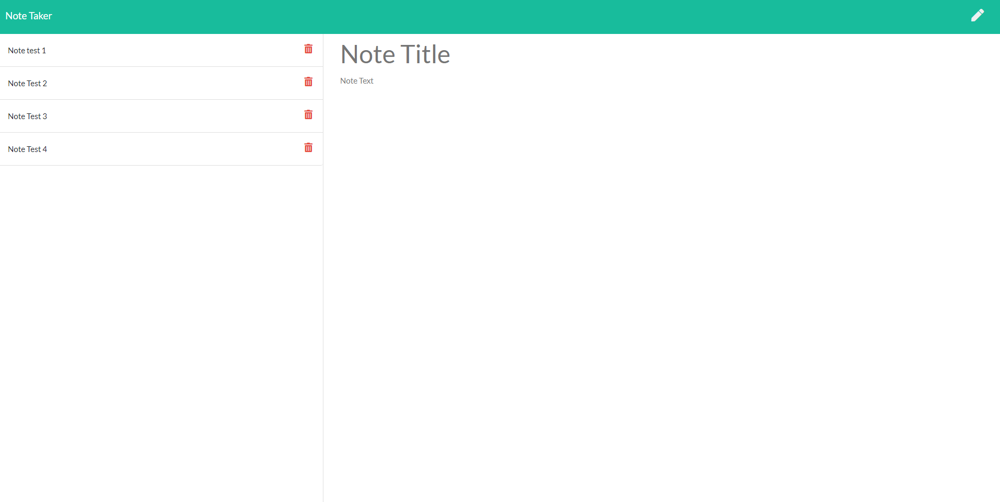

  # Title
  Note Taker

  ## Description
  

  An application that can be used to write, save, and delete notes.

  ## Table of Contents  
  [Installation](#Installation)  
  [Demo](#Demo)  
  [License](#License)  
  [Contributing](#Contributing)   
  [Questions](#Questions)  
   

  ## Installation
  Download 
  Run: npm i 
  Run: npm start 
  
  ## Demo
  

  ## License
  MIT

  ## Contributing
  No

  ## Questions
  Github: ldipaola
  Email: ldipaola66@gmail.com
